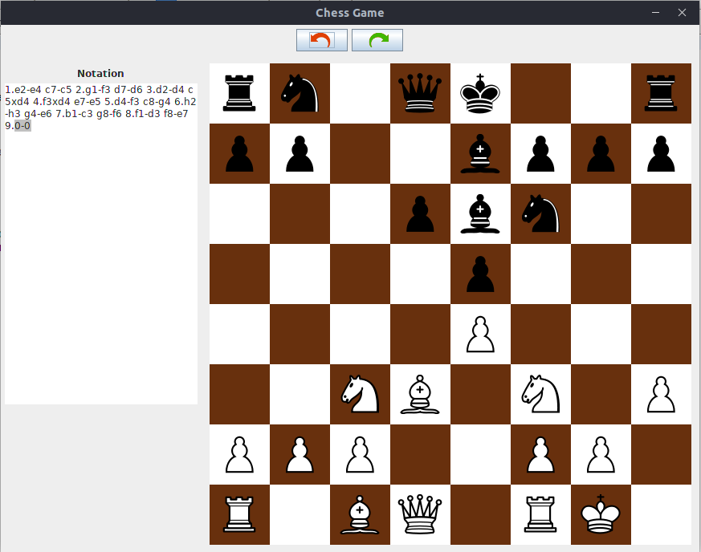

   
  <h1>Java Chess</h1>

   Java Chess is a program written for the 2013/2014 "Programming Methodologies" course held at Sapienza University of Rome by prof. Ivano Salvo. It is a fully functional player vs player graphical chess program (no AI) that comes along with an history functionality to keep track of the moves of the two players.
  

    
  

